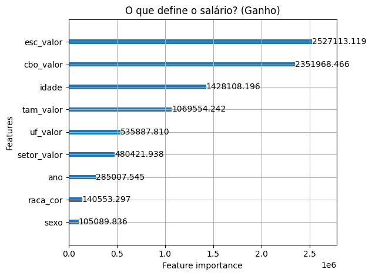

# Predição de Salários de Profissionais de TI no Brasil utilizando Base RAIS e Machine Learning

**Aluno:** Leandro Cesar Coelho da Silva  
**Orientadora:** Manoela Kohler

*Trabalho apresentado ao curso BI MASTER como pré-requisito para conclusão de curso e obtenção de crédito na disciplina "Projetos de Sistemas Inteligentes de Apoio à Decisão".*

- **Link para o código:** [https://github.com/LeCo851/tcc-puc-rio-predicao-salario-ti-rais](https://github.com/LeCo851/tcc-puc-rio-predicao-salario-ti-rais)

- **Trabalhos relacionados:**
    - Um estudo do perfil dos profissionais dos cargos formais de trabalho de Tecnologia da Informação e áreas correlatas: [Trabalho de conclusão de curso - UNIRIO](https://bsi.uniriotec.br/wp-content/uploads/sites/31/2024/12/202407AllaniseLeandro.pdf)

---

## Resumo
&nbsp;&nbsp;&nbsp;&nbsp;O presente trabalho apresenta o desenvolvimento de um sistema web completo para predição salarial de profissionais de Tecnologia da Informação (TI) no Brasil. Para garantir a fidelidade à realidade do mercado formal, o modelo foi treinado utilizando a base de dados oficial da Relação Anual de Informações Sociais (RAIS), processando cerca de 7 milhões de registros da área de TI e correlatas. A solução consolida técnicas de Ciência de Dados e Engenharia de Software ao expor um modelo de aprendizado de máquina (LightGBM) através de uma arquitetura de microsserviços distribuída. O sistema integra um backend em Java e Spring Boot responsável pela orquestração e correção monetária histórica via IPCA, uma API em Python e FastAPI dedicada à inferência do modelo, e um frontend interativo em Angular para visualização geoespacial dos dados. O projeto culminou em um produto de software funcional, escalável e acessível ao público leigo.

## Abstract
&nbsp;&nbsp;&nbsp;&nbsp;This work presents the development of a complete web system for salary prediction of Information Technology (IT) professionals in Brazil. To ensure accuracy regarding the formal job market, the model was trained using the official database of the Annual Social Information Report (RAIS), processing approximately 7 million records from the IT sector and related fields. The solution consolidates Data Science and Software Engineering techniques by exposing a machine learning model (LightGBM) through a distributed microservices architecture. The system integrates a Java and Spring Boot backend responsible for orchestration and historical monetary correction via IPCA, a Python and FastAPI API dedicated to model inference, and an interactive Angular frontend for geospatial data visualization. The project resulted in a functional, scalable software product accessible to the general public.

## 1. Introdução
&nbsp;&nbsp;&nbsp;&nbsp;Uma das maiores dificuldades no mercado de tecnologia atual é a precificação correta do trabalho. Estimar o valor real de um profissional de TI com base em sua experiência, cargo e localização exige o uso de dados concretos, fugindo de estimativas genéricas ou sites de pesquisas autodeclaradas. O objetivo deste trabalho é ir além da análise de dados exploratória e desenvolver um produto de software funcional que democratize o acesso a insights salariais confiáveis. Para isso, definiu-se como fonte primária a Relação Anual de Informações Sociais (RAIS), a principal base de estatísticas do mercado de trabalho formal no Brasil, permitindo que o algoritmo de regressão (LightGBM) aprenda a partir dos contratos de trabalho reais.

## 2. Modelagem
&nbsp;&nbsp;&nbsp;&nbsp;A construção do modelo exigiu estratégias metodológicas avançadas para contornar complexidades inerentes aos dados. Para lidar com a alta volumetria (Big Data) da RAIS, utilizou-se uma amostragem estratificada com cerca de 7 milhões de registros (2019 a 2024) otimizados no formato Parquet, garantindo eficiência de processamento. Variáveis de alta cardinalidade, como o CBO (Classificação Brasileira de Ocupações), foram tratadas via Target Encoding com média suavizada. Um dos maiores desafios contornados foi a ausência de classificações de senioridade (Júnior/Pleno/Sênior) na base administrativa; para solucionar essa lacuna, implementou-se a idade como variável proxy, calculando quartis dinâmicos em tempo real para inferir a maturidade profissional do indivíduo dentro de cada cargo.

&nbsp;&nbsp;&nbsp;&nbsp;Sob a ótica arquitetural, o ecossistema foi projetado em microsserviços conteinerizados via Docker, garantindo uma integração robusta entre os ecossistemas. A inferência de Machine Learning (LightGBM) foi encapsulada em uma API RESTful em Python (FastAPI). Já a orquestração e as regras de negócio foram alocadas em um backend desenvolvido em Java 17 com Spring Boot 4. Este backend atua não apenas como ponte, mas como validador, ele aplica algoritmos de engenharia financeira para corrigir valores nominais históricos via IPCA acumulado e executa um mecanismo de robustez estatística (*fallback*), acionando a média nacional caso a inferência local possua uma amostra inferior a 100 registros. Por fim, a interface visual foi construída em Angular 21+, utilizando a biblioteca HighCharts para renderização geoespacial interativa, com fluxos de CI/CD automatizados pelo GitHub Actions.

### Escopo de Profissionais (CBOs Avaliados)
&nbsp;&nbsp;&nbsp;&nbsp;Para delimitar o escopo do projeto estritamente aos profissionais de Tecnologia da Informação e áreas correlatas (Data Science, Infraestrutura, Gestão e Telecomunicações), a extração da base RAIS foi filtrada para contemplar as 40 ocupações abaixo, baseadas na Classificação Brasileira de Ocupações (CBO):

| Cargo / Ocupação (Parte 1) | Cargo / Ocupação (Parte 2) |
| :--- | :--- |
| Administrador de banco de dados | Engenheiro de equipamentos em computação |
| Administrador de redes | Engenheiro de redes de comunicação |
| Administrador de sistemas operacionais | Engenheiros de sistemas operacionais em computação |
| Administrador em segurança da informação | Especialista em pesquisa operacional |
| Analista de desenvolvimento de sistemas | Estatístico |
| Analista de e-commerce | Estatístico (estatística aplicada) |
| Analista de negócios | Estatístico teórico |
| Analista de pesquisa de mercado | Gerente de infraestrutura de tecnologia da informação |
| Analista de redes e de comunicação de dados | Gerente de operação de tecnologia da informação |
| Analista de riscos | Gerente de projetos de tecnologia da informação |
| Analista de sistemas de automação | Gerente de segurança da informação |
| Analista de suporte computacional | Gerente de suporte técnico de tecnologia da info. |
| Analista de testes de tecnologia da informação | Oficial de proteção de dados pessoais (dpo) |
| Arquiteto de soluções de tecnologia da informação | Pesquisador em ciências da computação e informática |
| Cientista de dados | Professor de computação (no ensino superior) |
| Desenhista industrial gráfico (designer gráfico) | Tecnólogo em gestão da tecnologia da informação |
| Desenvolvedor de multimídia | Técnico de comunicação de dados |
| Desenvolvedor de sistemas de TI (técnico) | Técnico de rede (telecomunicações) |
| Desenvolvedor web (técnico) | Técnico de suporte ao usuário de TI |
| Diretor de tecnologia da informação | Engenheiro de aplicativos em computação |

## 3. Resultados
&nbsp;&nbsp;&nbsp;&nbsp;O treinamento do modelo LightGBM sobre a base de aproximadamente 7 milhões de registros permitiu estabelecer inferências salariais consistentes para o setor de tecnologia da informação. Na avaliação quantitativa, o modelo alcançou um coeficiente de determinação (R²) de 48,31%, um resultado condizente com a natureza complexa e a alta variância dos salários de TI no Brasil. O Erro Médio Absoluto (MAE) situou-se em R\$ 2.444,68, com um Erro Percentual Absoluto Médio (MAPE) de 39,13% e a Raiz do Erro Quadrático Médio (RMSE) em R\$ 4.239,88. Estas métricas evidenciam que o algoritmo captura as tendências de mercado, porém confirmam que a remuneração final sofre forte influência de variáveis latentes não mapeadas na base da RAIS, como, por exemplo, o domínio de idiomas e a stack tecnológica específica do profissional.

&nbsp;&nbsp;&nbsp;&nbsp;De forma complementar à avaliação de erro, a análise de explicabilidade do modelo (Feature Importance) forneceu insights valiosos sobre a dinâmica salarial. O algoritmo revelou que a Escolaridade e a Ocupação (CBO) são os fatores mais significativos para a predição. Em terceiro lugar de importância destacou-se a Idade, o que valida matematicamente a estratégia adotada na etapa de modelagem de utilizá-la como variável proxy para tempo de experiência. Fatores como o porte da empresa e a geolocalização (UF) também demonstraram alto peso preditivo, confirmando que o modelo conseguiu capturar a realidade estrutural e econômica das contratações no país.

&nbsp;&nbsp;&nbsp;&nbsp;Sob a ótica da Engenharia de Software, o projeto alcançou com êxito o objetivo de integrar ecossistemas heterogêneos (Java e Python) de forma estável em um ambiente de nuvem (Render). A implementação de rotinas automatizadas de keep-alive mitigou os gargalos de latência (cold start) inerentes a plataformas de hospedagem gratuitas, garantindo a alta disponibilidade da aplicação. O resultado final consolida-se em uma interface web amigável, onde qualquer usuário, sem conhecimentos técnicos, pode consultar faixas preditivas de remuneração de forma intuitiva.

## 4. Conclusões
&nbsp;&nbsp;&nbsp;&nbsp;O trabalho demonstrou a viabilidade e o imenso valor agregado de unir a robustez da Engenharia de Software clássica ao potencial analítico do Machine Learning. O processamento da base RAIS forneceu a confiabilidade necessária para o domínio do problema, enquanto a adoção de tecnologias modernas (Spring Boot, Angular, FastAPI e Docker) permitiu a entrega de uma ferramenta de uso prático para a sociedade. Observa-se que a padronização de ambientes via containers e os pipelines de CI/CD foram cruciais para o sucesso da implantação. Trabalhos futuros podem explorar a inclusão de novas features preditivas e o escalonamento da infraestrutura para nuvens elásticas mais parrudas.

---

**Matrícula:** 232.100.304  
**Instituição:** Pontifícia Universidade Católica do Rio de Janeiro  
**Curso:** Pós Graduação Business Intelligence Master